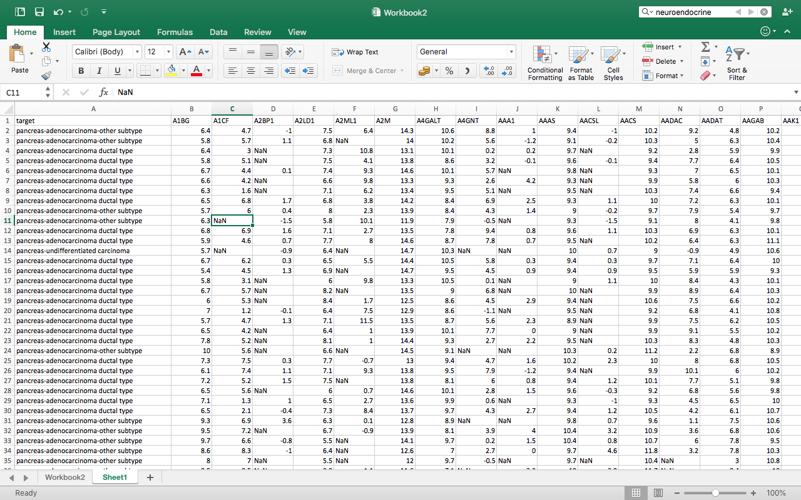
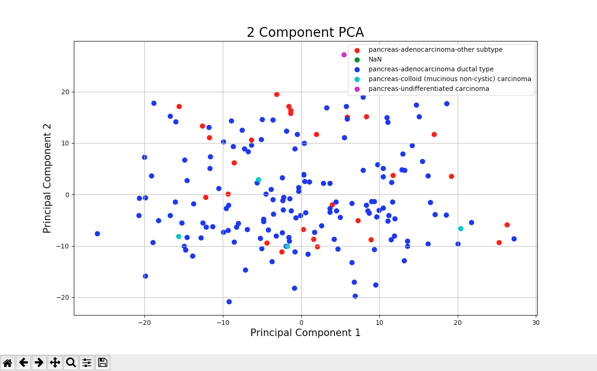

# knowledge_repo

Visualizing 2 or 3 dimensional data is not that challenging. However, PAAD dataset has approximately 18,000 dimensions. Here I've used PCA to reduce that into 2 or 3 dimensions so that we can plot and hopefully understand the data better.

Firstly, I did some pre-processing of the data. The data needed to be transposed (i believed), took the transpose, now the rows have become columns and columns have become rows.

Next, excess data was been removed, the fields such as age of the patient, days to death, alcohol intake etc. was churned out and only gene data along with the hitological_type label was retained.

Now the data looked somewhat like this:



Next the code goes like this:
```python
import pandas as pd
#read the csv, by giving the path
df = pd.read_csv("/Users/harshitmanek/Documents/beaver/dataset_small.csv")
```
Next we need to standardize the data,
PCA is effected by scale so we need to scale the features in our data before applying PCA. For this we have used StandardScaler.

```python
from sklearn.preprocessing import StandardScaler
#list of all genes
features = ['A1BG', 'A1CF', 'A2BP1', 'A2LD1',..............]
#Separating out the features
x = df.loc[:, features].values
#Separating out the target, this is the label that classifies whether the patient has adenocarcinoma tumor or neuroendocrine tumor. this is basically the histology_type
y = df.loc[:,['target']].values
#Standardizing the features
x = StandardScaler().fit_transform(x)
```

It should be noted that after dimensionality reduction, there usually isn’t a particular meaning assigned to each principal component. The new components are just the two main dimensions of variation.

```python
from sklearn.decomposition import PCA
pca = PCA(n_components=2)
```
After this you need to take care of the NaN values. I used SimpleImputer class for this. The SimpleImputer class provides basic strategies for imputing missing values. Missing values can be imputed with a provided constant value, or using the statistics (mean, median or most frequent) of each column in which the missing values are located. This class also allows for different missing values encodings.

```python
import numpy as np
from sklearn.impute import SimpleImputer
imp = SimpleImputer(missing_values=np.nan, strategy='mean')
imp.fit(x)
abc = imp.transform(x)
principalComponents = pca.fit_transform(abc)
principalDf = pd.DataFrame(data = principalComponents, columns = ['principal component 1','principal component 2'])
```
```
          principal component 1    principal component 2
0                 2.045269             -10.131430
1                 0.271137              -6.761248
2                11.055341              14.067472
3                 9.749496               5.805296
4                -9.963147              -7.286649
5                 3.668192               2.241550
6                 6.451303              -1.657133
7                -4.820374              -4.793436
8                -2.467697             -11.135430
9                16.962119              11.679844
10               -3.707624             -13.026548
11               -3.543493              -3.768080
12                5.466037              27.204303
```

Concatenating DataFrame along axis = 1. finalDf is the final DataFrame before plotting the data.

```python
finalDf = pd.concat([principalDf, df[['target']]], axis = 1)
```

```
            principal component 1    principal component 2                        target
0                 2.045269             -10.131430             pancreas-adenocarcinoma-other subtype
1                 0.271137              -6.761248             pancreas-adenocarcinoma-other subtype
2                11.055341              14.067472               pancreas-adenocarcinoma ductal type
3                 9.749496               5.805296               pancreas-adenocarcinoma ductal type
4                -9.963147              -7.286649               pancreas-adenocarcinoma ductal type
5                 3.668192               2.241550               pancreas-adenocarcinoma ductal type
6                 6.451303              -1.657133               pancreas-adenocarcinoma ductal type
7                -4.820374              -4.793436               pancreas-adenocarcinoma ductal type
```

Visualize 2D Projection
This section is just plotting 2 dimensional data. 

```python
import matplotlib.pyplot as plt
fig = plt.figure(figsize = (8,8))
ax = fig.add_subplot(1,1,1) 
ax.set_xlabel('Principal Component 1', fontsize = 15)
ax.set_ylabel('Principal Component 2', fontsize = 15)
ax.set_title('2 component PCA', fontsize = 20)
targets = ['pancreas-adenocarcinoma-other subtype', 'NaN', 'pancreas-adenocarcinoma ductal type', 'pancreas-colloid (mucinous non-cystic) carcinoma', 'pancreas-undifferentiated carcinoma']
colors = ['r', 'g', 'b', 'c', 'm']
for target, color in zip(targets,colors):
    indicesToKeep = finalDf['target'] == target
    ax.scatter(finalDf.loc[indicesToKeep, 'principal component 1']
               , finalDf.loc[indicesToKeep, 'principal component 2']
               , c = color
               , s = 50)
ax.legend(targets)
ax.grid()
```



-- Now to analyze the above, what we have done is we have reduced the dimension of approximately 18,000 genes per patient to 2 components. Which is not at all the optimized way to handle problems, we can increase the principal components to see where the in the graph the clusters begin to separate.

According to the above carried out analysis we can say that the neuroendocrine tumors are not clearly separable from the adenocarcinoma tumors when we reduce the dimension of our multi-variate dataset to just 2 principal components.

Variance in PCA:

The explained variance tells us how much information (variance) can be attributed to each of the principal components. This is important as while we can convert 18,000 dimensional space to 2 dimensional space, we lose some of the variance (information) when we do this.

Variance of the PCA can be calculated as:

```python
pca.explained_variance_ratio_
array([0.14416271, 0.10705592])
```

This concludes, together, the first two principal components contain 25.11% of the information. The first principal component contains 14.41% of the variance and the second principal component contains 10.70% of the variance. The other principal component contained the rest of the variance of the dataset.

We should try and bring the sum of the two variance to be 100%, this will reduce our error margins.


